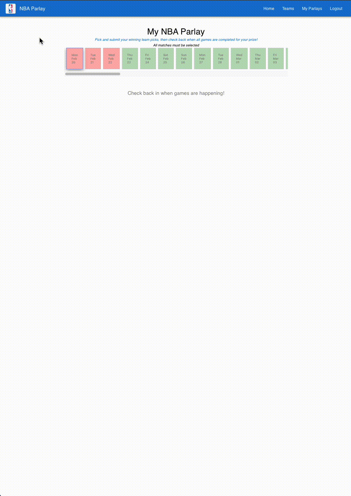
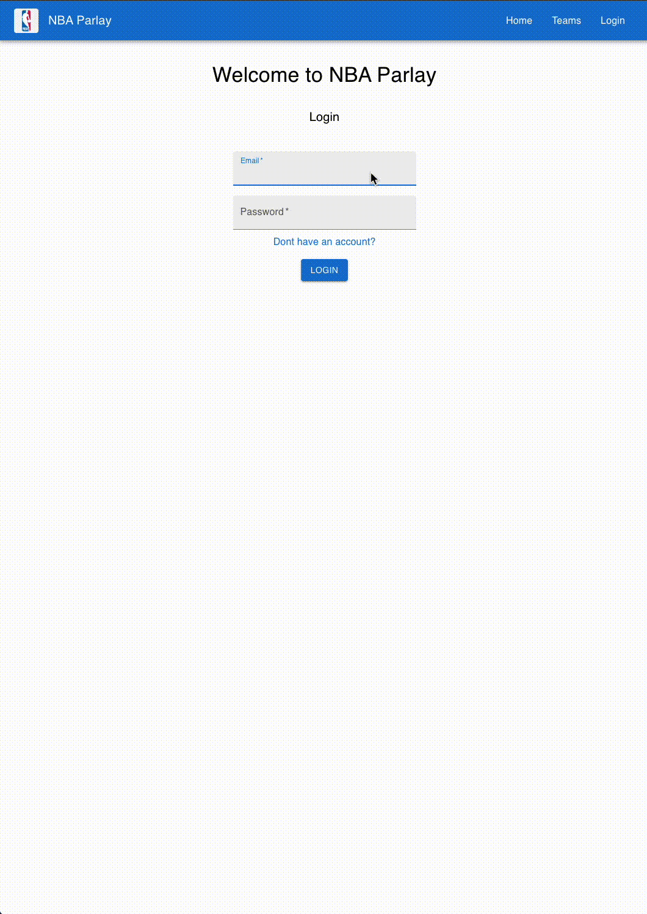

# NBA Parlay
View Deployed Version on AWS EC2 instance [here](http://34.222.48.98:4001/)
An application that utilizes real-time NBA data from an API that allows for users to create parlays, view team stats, and live scores which are winning picks of each NBA match that is currently going on.
* The application is split into two main parts, the front end react (client) and the back-end express server that utilizes MongoDB and Mongoose to persist data.

* The NBA API had various endpoints, and contained a lot of data, for example a single NBA season has about 6000+ games. Continuously loading the data was expensive, so I optimized my server to do a bulk save into a database. I also utilized `useInterval()` to perform a routine update of the data in the background asyncronously

* A frond end optimization I used was utilized the `useContext` hook to load data in the background on the front end and creating a method to filter through the data, when a user clicks a different date on the calendar and load that data. This was a form of `pagination` in order to optimize load times and only loading a subset of the large game data.

---
### Client
* Using HTML, CSS/SCSS, JSX, Javascript, and React the user is routed to the main page using `react-router-dom` which displays various pages based on whichever link is clicked by the user. Data, and state utilize hooks such as `useContext` and `useState` and loads data from various endpoints that makes a get request upon components mounting using `useEffect` The main pages consist of:
Project Highlights:
* React
* React router dom
* useState, useEffect, useContext, 
* SCSS / Material UI
* JS array methods, (`.some(), all(), .filter(), .map()`)
* Conditional Rendering 
* NodeJS / Express
* Using middleware
* JWT / Cookies (User authentication / registering)
* Axios
* HTTP request methods  / API Routes (GET, POST, PUT, DELETE)

* `/` - index (Main page)

* `/teams` - All NBA Teams page
* `teams/:id` - Individual team pages with `stats` and data visualization charts using `ChartsJS` 

* `/parlays` - Each parlay that a user has submitted and gets checked

* `/register` and `/login` pages to allow for authentication

### Server
* In this application the server is the gateway between the client and the NBA-API and supplies the client with data whie also saving user account data in a database
* The application uses Express and utilizes a MVC approach along with various middlewares to accept data via request body, authenticate users, and use cookies.

The server's file structure is separated into models, routes, and controlller methods while `server.js` is the main entry point. When the server is set to `production` mode, a script builds an optimized/minified version in the `/build` folder that is served by the Express server